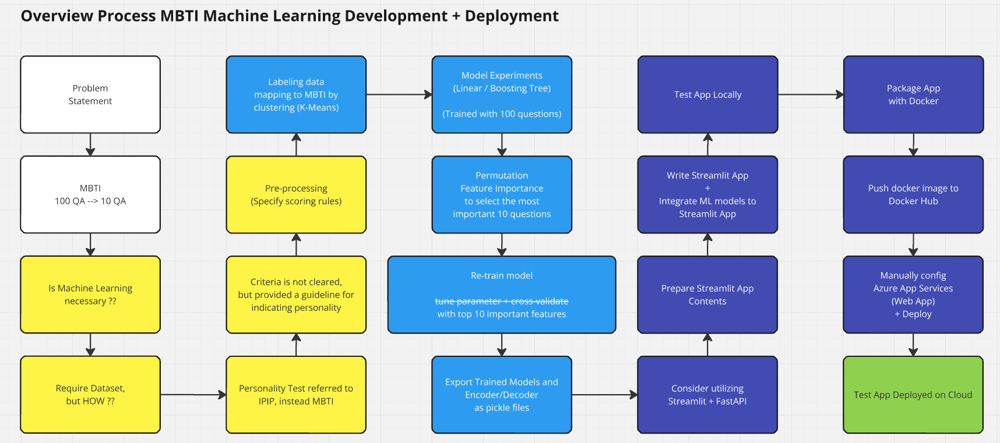
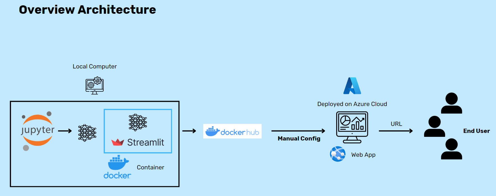
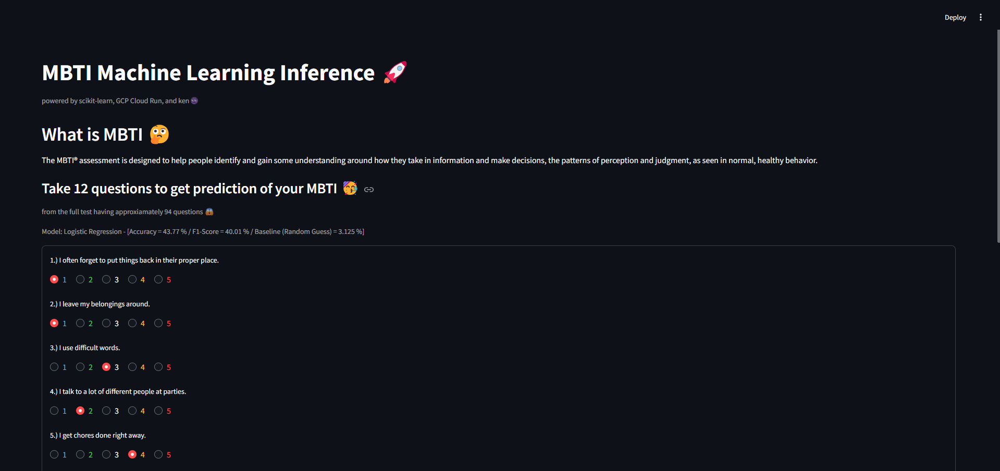
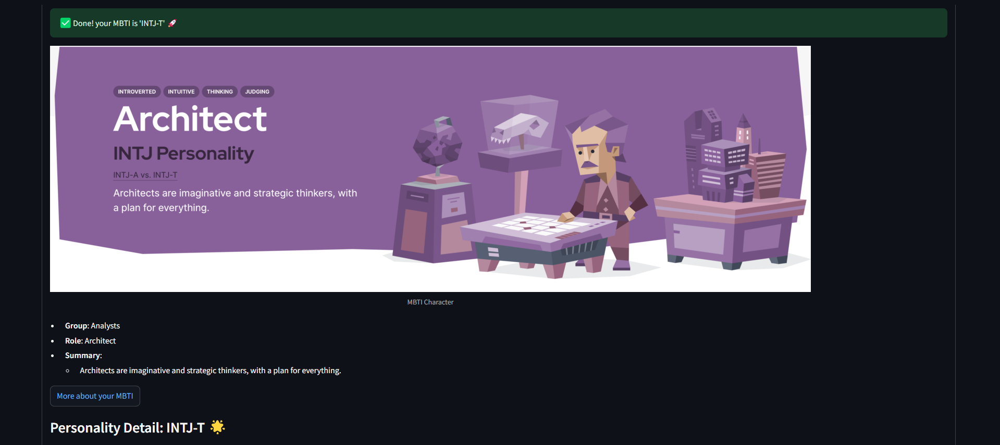

# MBTI - IPIP
*- Know your MBTI within 12 questions through ML model deployed with streamlit on Azure cloud -*

*patcharanat p.*

***Non-commercial Project***

## Introduction
Taking nearly 100 questions to know your MBTI could take a lot of time. How about knowing your MBTI within 12 questions ?? predicted by Machine Learning deployed with Streamlit on Azure Cloud

## Table of Contents
1. [Getting Started](#1-getting-started)
2. [Model Deployment](#2-model-development)
3. [Deployment](#3-deployment)
4. [Appendix](#4-appendix)
    - [About Dataset](#about-dataset)
    - [Mapping Personalities IPIP to MBTI](#mapping-personalities-ipip-to-mbti)
    - [MBTI Contents](#mbti-contents)

## 1. Getting Started
This sub-project is quite focused on data science methodology, including initiating a problem, how we use ML to solve the problem, and how we manipulate or label the data to meet the requirement. Even though, MLOps practices, especially ML model deployment, still play a crucial role to deliver developed ML as an usable product as a web service with docker container, streamlit, and Azure cloud Web App service.

- Core component for the project consist of:
    - [Dockerfile](Dockerfile)
        - containerize ML application.
    - streamlit/[requirements.txt](./streamlit/requirements.txt)
        - dependency of the application required in the container.
    - streamlit/[main_app.py](./streamlit/main_app.py)
        - Streamlit App (Web-based UI)
    - streamlit/models/*
        - Contained ML model, Encoder/Decoder, and list of input questions used in Streamlit App
    - streamlit/mbti_info/*
        - Contained application's text contents
    - streamlit/picture/*
        - Contained application's picture contents
- To run application locally for development or testing, please enable `pyenv` in root working directory and run this:
    ```bash
    streamlit run mbti_ipip/streamlit/main_app.py
    ```

## 2. Model Development
- Overall Process

- Overview Architecture

- Development Notebook
    - [ML-Learning - mbti_ipip - Github Patcharanat](https://github.com/Patcharanat/ML-Learning/blob/master/mbti_ipip/model_dev.ipynb)
- Output



## 3. Deployment
- Currently, I deployed the application manually through CLI. You might need docker hub account, and azure cloud account.
- You might also need to change some variables to match your account.
- Extending project to CI/CD with Github Action (GHA) will be the next step in development.
```bash
# docker build -t <image-name>:<optional-tag> <dockerfile-location-relative-to-current-workdir>
docker build -t kde-mbti-streamlit mbti_ipip/.

# test running on local
# docker run -p 8501:8501 <image-name>
docker run -p 8501:8501 kde-mbti-streamlit

# check http://localhost:8501

# check files inside the container
docker exec -it <container-id> bash
docker stop <container-id>

# rename image
# docker tag <built-image-name>:<tag> <repo-name>:<optional-tag>
docker tag kde-mbti-streamlit:latest patcharanat/kde-public-repo
# In docker ui image tab, you will see another image name is the same as repo's name

# push to docker hub
# docker push <renamed-image-name>:<tag>
docker push patcharanat/kde-public-repo:latest
```
- preparing Streamlit to production, you can find more details at [Official Documentation from Streamlit](https://docs.streamlit.io/deploy/tutorials/docker)
- The latest progress, I manually configured Azure Web App to deploy the app as docker image from docker hub on cloud. You can find more information about deployment here:
    - [Pushing Docker Image to Docker Hub - Youtube - Shaw Talebi](https://youtu.be/pJ_nCklQ65w?si=C0T-OnEd_BbAvsdV&t=1035)
    - [How to deploy and test docker container websites using Azure app service - Youtube - LetMeTechYou](https://youtu.be/Fl9AIKj8UAY?si=hnUq7S4ut8v7-zEj&t=228)

## 4. Appendix
### About Dataset
- [Big Five Personality Test - Kaggle](https://www.kaggle.com/datasets/tunguz/big-five-personality-test)
- [Local Data Dict](./data/codebook.txt)
- [International Personality Item Pool](https://ipip.ori.org/)
- [Converting IPIP Item Responses to Scale Scores](https://ipip.ori.org/newScoringInstructions.htm)
- [Big-Five Factor Markers - Questions Classification](https://ipip.ori.org/newBigFive5broadKey.htm)
- [Interpreting Individual IPIP Scale Scores](https://ipip.ori.org/InterpretingIndividualIPIPScaleScores.htm)
- [MBTI - Letters personalities explain](https://www.16personalities.com/articles/our-theory)

### Mapping Personalities IPIP to MBTI
- Factor I (EXT questions)
    - Surgency or Extraversion = Introversion or Extroversion (I/E)
- Factor II (AGR questions)
    - Agreeableness = Thinking or Feeling (T/F)
- Factor III (CSN questions)
    - Conscientiousness = Judging and Perception (J/P)
- Factor IV (EST questions)
    - Emotional Stability = Turbulance or Assertive (T/A)
- Factor V (OPN questions)
    - Intellect or Imagination = Sensors or Intuitives (S/N)

### MBTI Contents
- Introversion or Extroversion (I/E)
    - **Extroversion:** E stands for Extraversion, and people who have this personality preference are energized by the outer world of people and things. They generally share their ideas verbally and “recharge” by being around other people.
    - **Introversion:** I stand for Introversion, and people with this personality preference are energized by their inner world. In contrast to people with preferences for Extraversion, Introverts use their energy interacting with people and things and gain energy by spending time alone and in their heads. They usually prefer to go through all their ideas and then share them out loud.
    - ***NOTE:** Any one person is not completely extraverted or completely introverted, you actually use both preferences throughout your day. One just comes more naturally to you – just like you naturally cross your arms one way and the other way feels a little awkward (but that doesn’t mean you can’t do it!).*
- Sensors or Intuitives (S/N)
    - **Sensors:** S is for the Sensing preference. People who have the letter S in your MBTI type tend to process things in a step-by-step linear sequence and observe and remember specific information. They also tend to focus on the facts and what can be observed via their five senses.
    - **Intuitives:** N is for the Intuition and people who have a preference for Intuition generally learn by seeing the big picture and themes, and thinking about how specific information is connected.
- Thinking or Feeling (T/F)
    - **Thinking:** the letter T is for Thinking, and people who have this preference tend to make decisions based on pros and cons, and weighing logical consequences from an objective point of view. Thinking individuals focus on objectivity and rationality, prioritizing logic over emotions. They tend to hide their feelings and see efficiency as more important than cooperation.
    - **Feeling:** the letter F indicates someone who has a preference for Feeling, meaning that they make decisions based on how those decisions might affect other people involved. Feeling individuals are sensitive and emotionally expressive. They are more empathic and less competitive than Thinking types, and focus on social harmony and cooperation.
    - ***Note:** Just because you have a preference for Thinking or Feeling doesn’t mean you can’t see things from the other side, again it just means when you first consider making a decision, you’re going to use this preference FIRST and may or may not use the other preference (depending on how self-aware you are, if someone else involved brings in the opposite preference, etc.)*
- Judging and Perception (J/P)
    - **Judging:** the letter J stands for Judging, and people who have a preference for judging are the list-makers and planners. They like to have a structure and schedule to their time and will generally space out projects so they get work done a bit at a time.
    - **Prospecting:** the letter P stands for Perceiving, and people with this preference are the ones who want flexibility in their lives and in how their time is managed. They would rather be open to new opportunities for events and like making decisions on the fly, and can sometimes enjoy working on things at the last minute or on their own schedule.
- Turbulance or Assertive (T/A)
    - **Turbulance:** turbulent individuals are self conscious and sensitive to stress. They are likely to experience a wide range of emotions and to be success driven, perfectionistic, and eager to improve.
    - **Assertive:** assertive people are self assured, even tempered and resistant to stress. They refuse to worry too much and do not push themselves too hard when it comes to achieving goals
---
